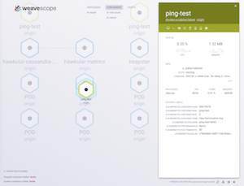
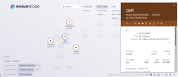

# demo

| Icon   | Demo        |
| ------ | ----------- |
|  | [traffic-control-rkt](traffic-control-rkt/)  simulating network issues with Linux traffic control between a RTP/RTSP media server running in rkt and a video player |
|  | [traffic-control-k8s](traffic-control-k8s/)  simulating network issues with Linux traffic control on the Kubernetes Guestbook application |
|  | [traffic-control-openshift](traffic-control-openshift/)  simulating network issues with Linux traffic control on Kubernetes using OpenShift |
|  | [traffic-control-microservices-demo](traffic-control-microservices-demo/)  simulating network issues in a microservices demo application |
|  | [build-container-images](build-container-images)  building container images with different tools |
