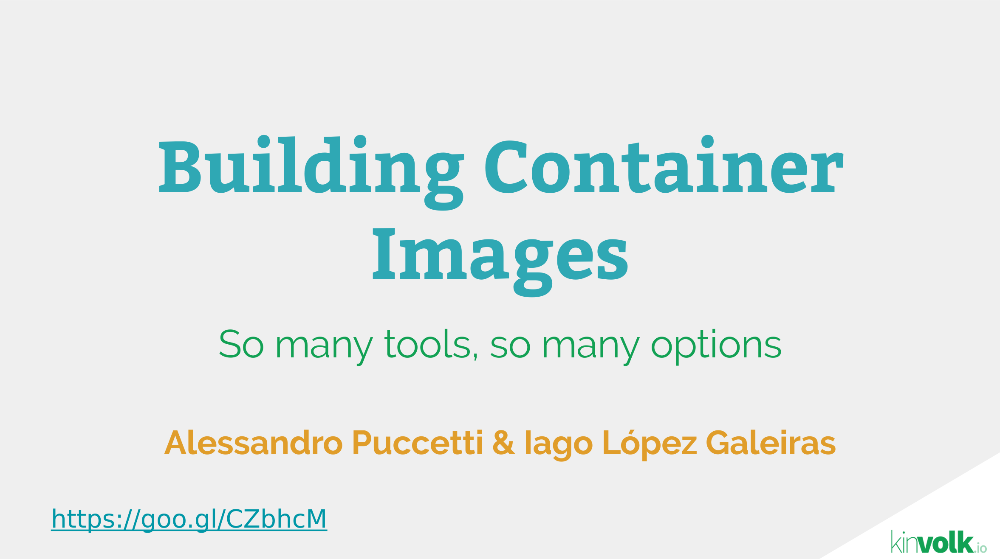

# Build Container Images

Scripts used at LinuxCon for the talk [Building Container Images](https://goo.gl/CZbhcM).

## Dependencies

* [scriptreplay_ng](https://github.com/scoopex/scriptreplay_ng): To replay the shell sessions under the `script/` directories.
* [Docker](https://docs.docker.com/engine/installation/linux): To build the Docker example.
* [rkt](https://github.com/coreos/rkt): To run the resulting images of the dgr, containers/build and nix examples.
* [dgr](https://github.com/blablacar/dgr): To build the dgr images.
* [containers/build](https://github.com/containers/build): To build the containers/build and nix examples.
* [nix](http://nixos.org/nix): To build the nix examples.
